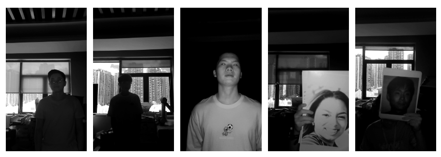

## Describe our IFAST project

You are currently viewing our IFAST project. We design a new task for face anti-spoofing named disparity-based binocular NIR camera single-shot face anti-spoofing. For this task, we designed a novel method name IFAST and made our own dataset named BNI-FAS, which took me a lot of time, money and effort.

We have completed an ethical review by an ethics committee to ensure that the open-source dataset does not involve breaking the law. We promise to release all images and labels of our dataset and code online as soon as the paper is accepted. We upload a small proportion of the dataset, which has completed the ethical review process and received informed consent from the subjects.

[Get a small part of our dataset](https://pan.baidu.com/s/1xjV4stSLTwWNuMVn1cEdOw)

You can contact us by email jc.huang@siat.ac.cn to get the extraction code of the above drive.

## Showing of our dataset!

## Coming soon
We will release our paper, code and dataset as soon as our paper is accepted.
